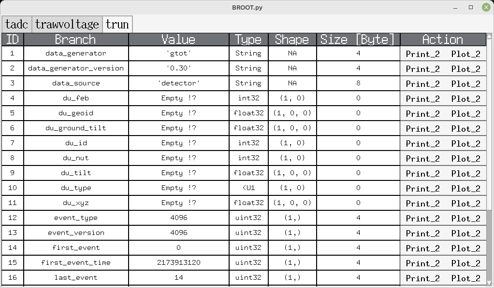

# BROOT presentation

BROOT is a browser for [ROOT files](https://root.cern/manual/io), format defined and used by CERN collaboration.

BROOT is an alternative to the [TBrowser tool](https://root.cern/manual/root_files/#root-object-browser)

BROOT doesn't use the ROOT library but the IO-specific [uproot](https://uproot.readthedocs.io/en/latest/) library.

BROOT installs very simply with pip install

```
pip install git+https://github.com/luckyjim/BROOT.git 
```

# BROOT GUI

## Table for each TTree


### Basic print value


## Basic plots

Range of plot is configurable with same syntax as numpy array.

### Plot 1D


### Spectrum 1D


### Histogram


