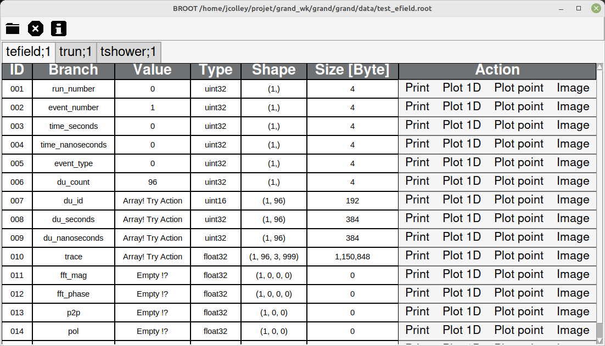
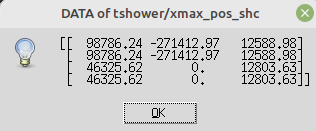
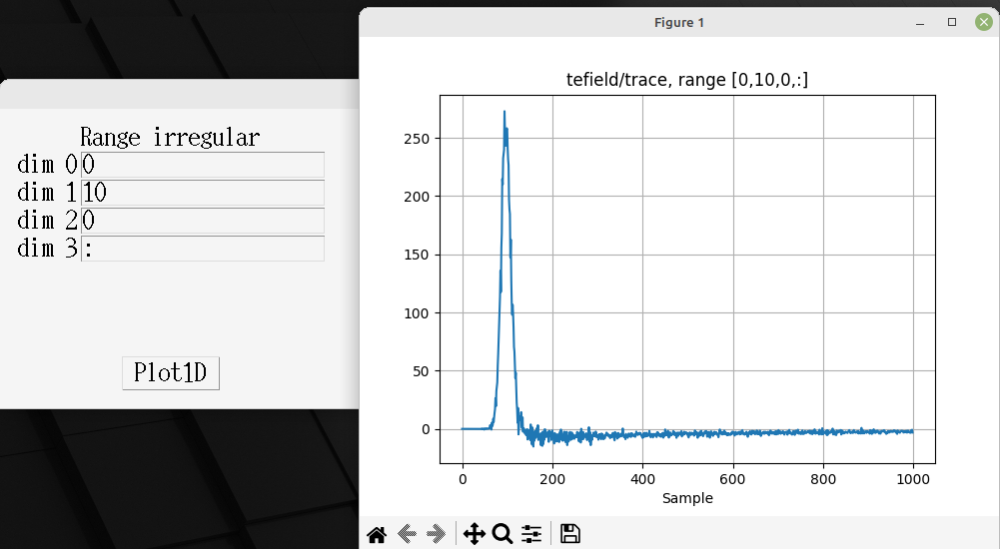
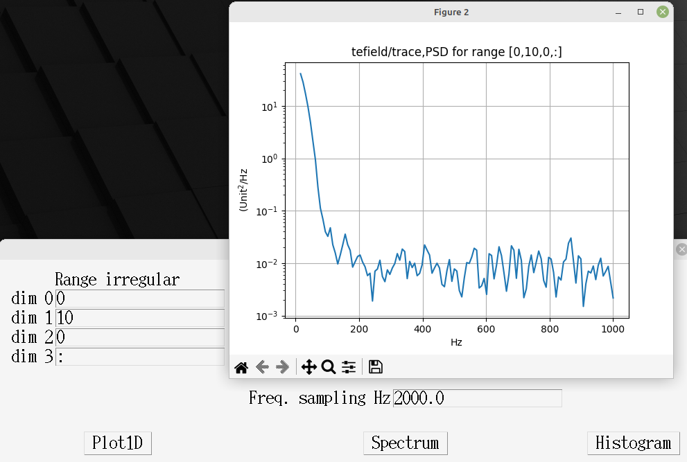
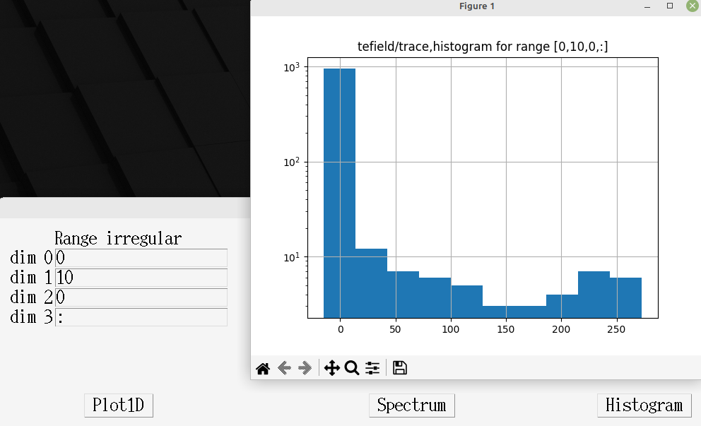
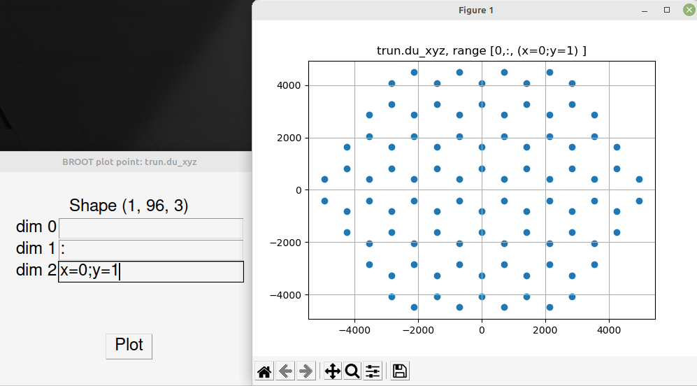
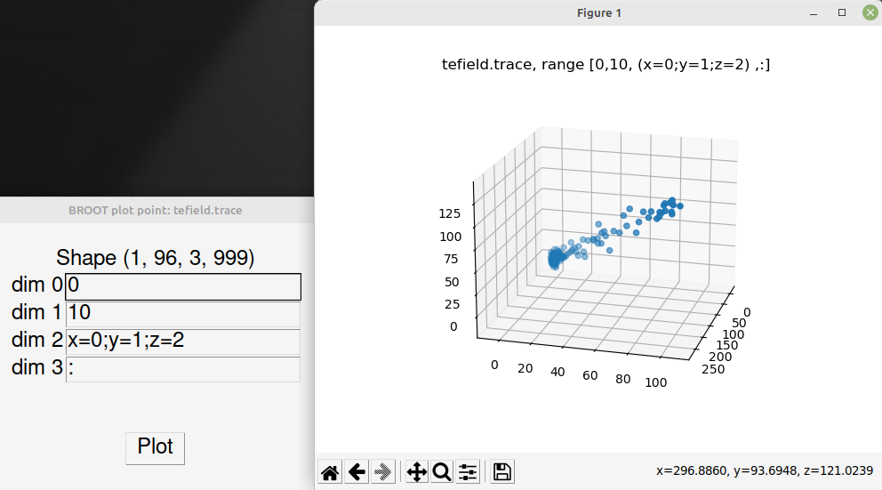
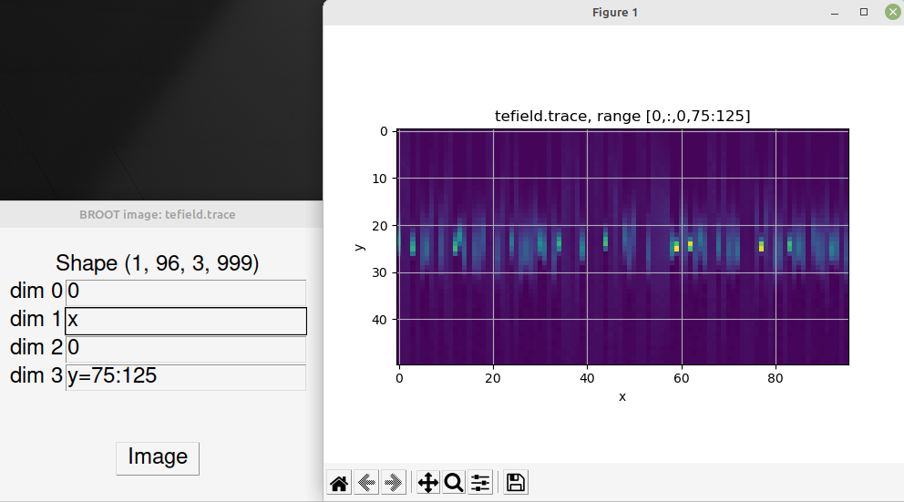

# BROOT presentation

BROOT is a browser for [ROOT files](https://root.cern/manual/io), format defined and used by CERN collaboration.

BROOT is an alternative to the [TBrowser tool](https://root.cern/manual/root_files/#root-object-browser)

BROOT doesn't use the ROOT library but the IO-specific library [uproot](https://uproot.readthedocs.io/en/latest/).


# BROOT GUI

## Table for each TTree



### Action "Print"

This action can be applied on small array, 



else you can try another actions of plots.

### Basic plots

Range of plot is configurable with GUI, same syntax as [numpy](https://numpy.org/doc/stable/user/basics.indexing.html#basic-indexing) array. [Matplotlib](https://matplotlib.org/) is used to create the figures.

#### Action "Plot 1D"

For each dimension, you must define a range with python/numpy convention or an index.

We apply the numpy flatten function to the final array to obtain a 1D array.

You can have 3 representations of the 1D array:
* plot by sample
* power spectrum density
* histogram

#### Plot sample



#### Power spectrum density

You can configure the frequency of sampling with GUI.



#### Histogram



#### Action "Plot point"

With this action you can plot points in 2D or 3D space. For each dimension, you must define a range with python/numpy convention or an index.
The definition of axis x, y and optionaly z must be in the same dimension with syntax:
* x=integer ; y=integer

"=" is optional, it's 2 definitions are equivalent:
* x=0 ; y=1
* x0 ; y1

The global shape for each axis must be a 1D array, so the symbol ":" must only appear once in one of the dimensions.



For 3 dimensions: 
* x=integer ; y=integer ; z=integer

the associated figure is interactive, it allows you to choose your viewing angle



#### Action "Image"

You must defined x axis and y axis in different dimension. By default "x" in dimension means takes all data, like "x=:".

You can defined range after x or y, example:

* y=75:125



# Installation

Check if tkinter library is correctly installed with

```
python -m tkinter
```

else see [installation documentation](https://tkdocs.com/tutorial/install.html)

upgrading pip and setuptools packages can help

```
pip install --upgrade setuptools pip
```

then BROOT installs very simply with pip install

```
python -m pip install git+https://github.com/luckyjim/BROOT.git 
```

run BROOT in a terminal with this command

```
BROOT.py
```

# Update version

```
python -m pip uninstall BROOT
python -m pip install git+https://github.com/luckyjim/BROOT.git 
 ```
 
# Other ROOT file browser

* [uproot-browser](https://github.com/scikit-hep/uproot-browser) with TEXT gui
* [uproot_browser](https://github.com/jrueb/uproot_browser) with GTK gui
* [jsroot](https://github.com/root-project/jsroot) in HTML using [Visual Studio Code](https://root.cern/blog/vscode-extension-announcement/)